#### [Atrás](metodologia.md) -- [Índice](index.md) -- [Siguiente](resultados.md)
***

# Datos

Para este proyecto se emplea el Kvasir-Capsule dataset disponible en [link](https://github.com/simula/kvasir-capsule). 

Se trata de un dataset de video del que hay disponibles una serie de imágenes etiquetadas con hasta 14 categorías así como gran cantidad de imágenes y videos sin etiquetar.

## El Kvasir-Capsule datase

Las imágenes corresponden a regiones y lesiones del sistema digestivo humano. Dado que algunas clases están excesivamente infrarepresentadas, se han tomado las siguientes 11 clases como válidas para realizar este estudio.

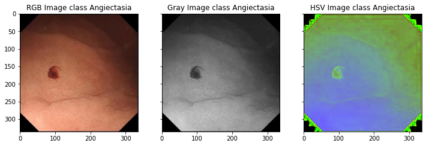
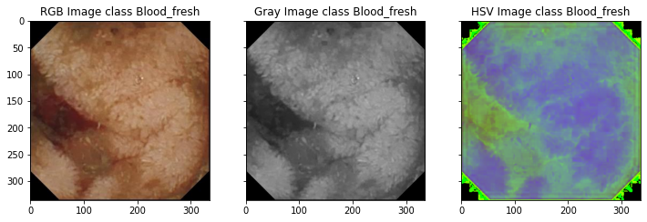
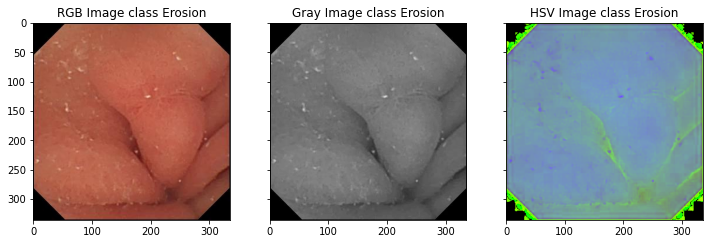
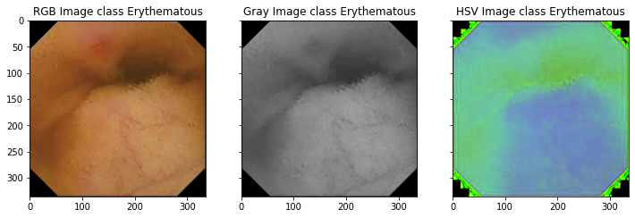
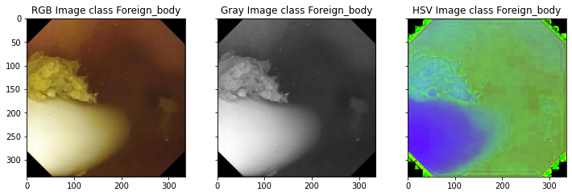
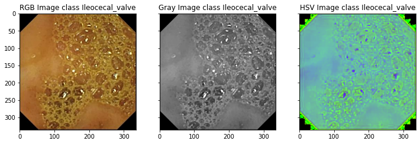
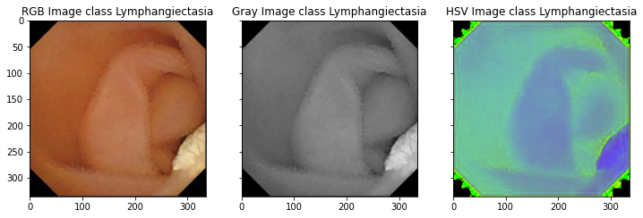
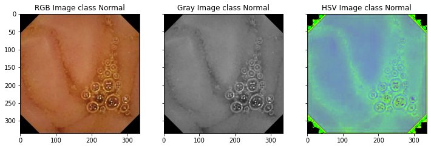
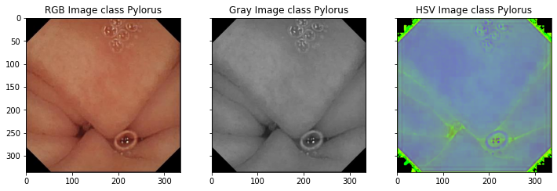
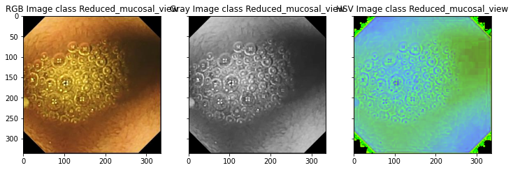
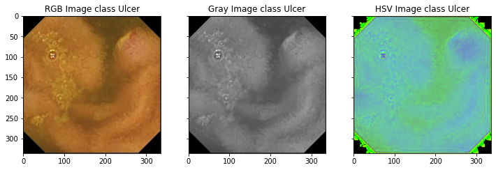

## Análisis del dataset

El número de imágenes presente en todo el dataset oculta la incómoda realidad de muchos datasets: desbalanceo entre clases, es decir, no hay la misma cantidad de imágenes para cada clase.

| Clase | Número de muestras |
| ------------- | ------------- |
| Angiectasia | 866 |
| Blood_fresh | 446 |
| Erosion | 506 |
| Erythematous | 159 |
| Foreign_body | 776 |
| Ileocecal_valve | 4189 |
| Lymphangiectasia | 592 |
| Normal | 34.338 |
| Pylorus | 1529 |
| Reduced_mucosal_view | 2906 |
| Ulcer | 854 |

Este desbalanceo es palmario al realizar un histograma de frecuencia de todo el dataset.

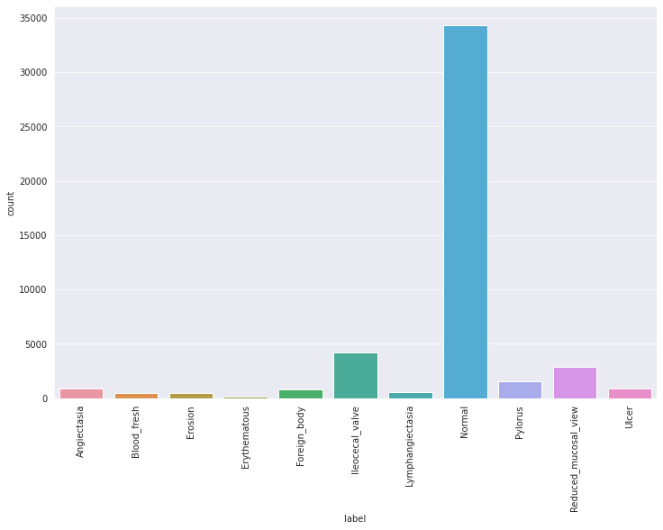

## Datos de entrenamiento y validación

Este trabajo se considera una aproximación al problema presentado, con fines didácticos, por lo que tomé la decisión de aplicar los modelos a todo el dataset, reservando un 30% para validación.
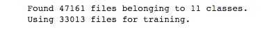
Los datos son alimentados en el sistema via un objeto Dataset que toma las imágenes RGB y las resamplea a un tamaño 100x100 píxels, para facilitar el entrenamiento y para que el entorno de proceso fuera capaz de aceptar los datos sin exceder los límites de RAM.
***
#### [Atrás](metodologia.md) -- [Índice](index.md) -- [Siguiente](resultados.md)
