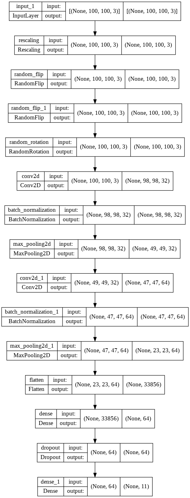
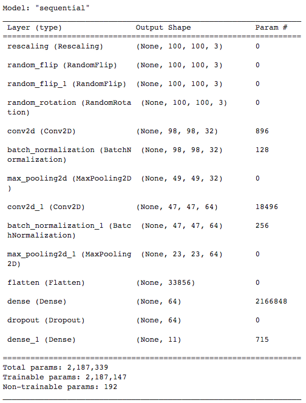
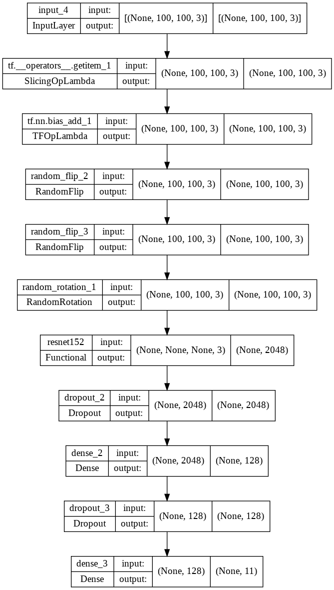
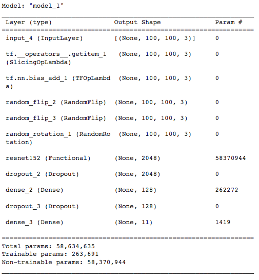
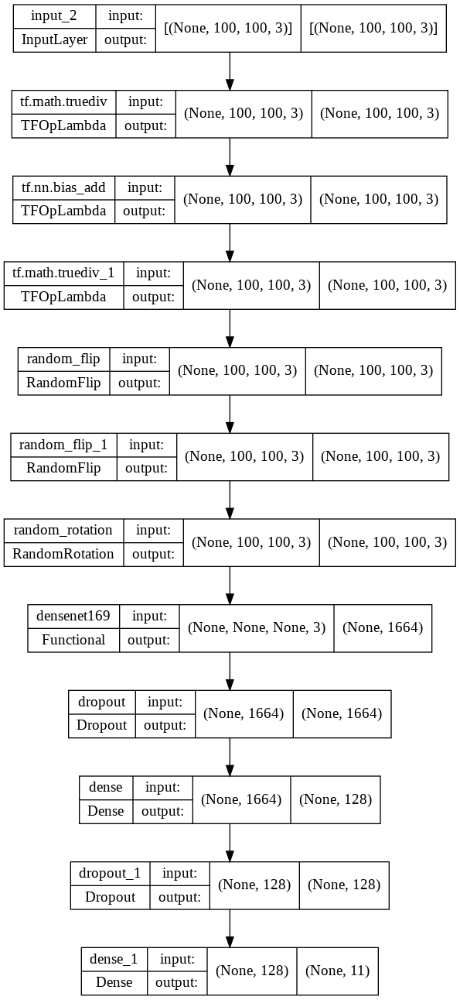
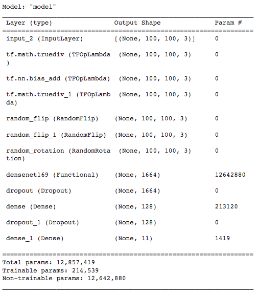
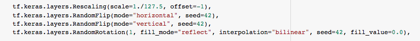
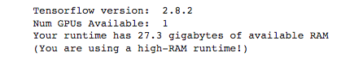
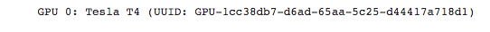

#### [Atrás](introduccion.md) -- [Índice](index.md) -- [Siguiente](datos.md)
***

# Metodología

A continuación se describen las redes neuronales y principales características para su uso. El framework empleado es Keras, como API de Tensorflow. Los modelos se construyen sobre el sistema Sequential, que permite integrar al modelo la mayoría de elementos del mismo.

## Red convolucional simple ConvoRGB

El primer modelo empleado, que denominaré, ConvoRGB está formado por dos capas convolucionales, seguidas de normalización y pooling. A continuación se realiza un flatten y se pasa por una capa densa y se alcanza la capa de salida a través de un dropout.

La función de las capas es la siguiente:
- Convolucional: son capas que aprenden a reconocer patrones geométricos 2D como formas y texturas, y características de las imágenes como colores, contraste, etc.
- Normalización: mejora el entrenamiento al volver a centrar y escalar la salida.
- Pooling: reduce la cantidad de datos tomando uno (por ejemplo el máximo) como representación de un grupo de ellos.
- Flatten: esta capa permite reorganizar los datos de las capas convolucionales para que entren a una densa.
- Densa: es una capa convencional de neuronas que aprende a partir de los resultados de las convolucionales.
- Dropout: tiene por misión desconectar durante el entrenamiento algunas conexiones, para evitar el sobreentrenamiento o overfitting.

Como puede observarse la red tiene algo más de 2 millones de parámetros para ser entrenados, dado que no hay inicialización previa.

## Transferencia de aprendizaje

La segunda opción planteada será el uso de redes pre-entrenadas, adaptadas al caso concreto de estudio. Esta técnica permite el uso de redes mucho más complejas que la anterior entrenadas con bases de datos de imágenes ingentes como la Imagenet.

En este caso emplearé un par de redes que han sido usadas previamente para trabajos similares. Son la ResNet152 y la DenseNet169.

La principal ventaja de esta técnica es permitir el uso de redes complejas, para cuyo entrenamiento no sería suficiente con el dataset problema. En definitiva es un recurso para mejorar los resultados con un bajo coste computacional.

### Transferencia de aprendizaje con ResNet

La ResNet es una red neuronal de tipo residual cuya principal característica es que permite conexiones o saltos sobre algunas capas, que pueden ser dobles o triples.

A su estructura básica, sin la capa final, añadimos una capa densa previa a la capa de salida.

Pese a que todo el modelo suma casi 60 millones de parámetros, apenas poco más de 250 mil son entrenables y para el resto se hace uso de los pesos calculados para las imágenes de ImageNet.

### Transferencia de aprendizaje con DenseNet

La DenseNet es una red neuronal residual como la ResNet, pero además permite varios saltos paralelos entre capas o grupos de capas.

Análogamente al caso anterior, a su estructura básica, sin la capa final, añadimos una capa densa previa a la capa de salida.

De nuevo, pese a que este modelo suma casi 13 millones de parámetros, apenas poco más de 210 mil son entrenables y para el resto se hace, de nuevo, uso de los pesos calculados para las imágenes de ImageNet.

## Data Augmentation

Por data augmentation entendemos una serie de técnicas para incrementar el dataset de entrenamiento, via transformaciones del mismo. Su función es evitar el sobreentrenamiento de la red (que la red memorize sin generalizar).

En nuestro caso realizaremos una normalización (adecuada para cada modelo) y tres transformaciones de las imágenes:
- Volteado horizontal
- Volteado vertical
- Rotación aleatoria

## Obtimizado

La obtimización es el método matemático que se emplea para calcular los parámetros del modelo durante el entrenamiento. En nuestro caso empleamos el Stochastic gradient descent o SGD que se parametriza con el ritmo de entrenamiento y con el momentum.

El ritmo de entrenamiento o learning rate es el paso empleado para modificar los parámetros del modelo, mientras que el momentum es un recurso para acelerar el entrenamiento cuando este está resultando eficiente.

Además, es posible configurar el tamaño de batch (número de imágenes que se procesarán simultáneamente) y el número de pasos o epochs de entrenamiento.

Para los modelos propuestos estos son los parámetros empleados:

| Parámetro | Red convolucional simple | Red basada en ResNet| Red basada en DenseNet |
| ------------- | ------------- | ------------- | ------------- |
| Obtimizador | Stochastic gradient descent | Stochastic gradient descent | Stochastic gradient descent |
| Ratio de aprendizaje | 0.0001 | 0.0001 | 0.0005 |
| Momentum | 0.9 | 0.9 | 0.9 |
| Tamaño de batch | 128 | 128 | 128 |
| Número de epochs | 1.000 | 3.000 | 3.000 |

## Tipos de callbacks

Los callbacks son funciones que se ejecutan tras cada ejecución y que permiten diversos servicios o funcionalidades.

En estre trabajo se han definido algunos callbacks entre los que destacan:
- CSVLogger: registra los parámetros del entrenamiento en formato estándar, permitiendo gráficas o análisis posterior.
- ModelCheckpoint: hace un seguimiento del entrenamiento y guarda los parámetros del modelo cuando se obtiene un mejor resultado que previamente.

El primero permite realizar gráficas, mientras que el segundo permite detener y reanudar o extender el entrenamiento.

## Entorno de ejecución Google Colab

Para este trabajo se ha empleado Google Colab para desarrollar y ejectuar los entrenamientos. Esta elección está motivada por no disponer de una GPU física en la que ejecutar el código en un plazo razonable.

Cuando las metodologías y entrenamientos definitivos fueron definidos, se recurrió a una cuenta de pago Colab Pro, para garantizar un acceso preferencial a los recursos y permitir entrenamientos de cuantas epochs fueran necesarios.

La persistencia de los entrenamientos se garantiza por el uso de Google-Drive en su versión gratuita para guardar los logs y los mejores modelos.

***
#### [Atrás](introduccion.md) -- [Índice](index.md) -- [Siguiente](datos.md)
